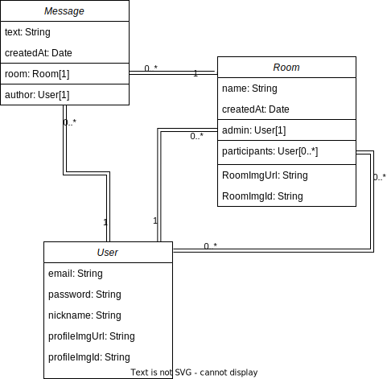

# Messaging app (MessageMe) (backend segment)
## Description
This project is the part of the [TOP project: Messaging app](https://www.theodinproject.com/lessons/nodejs-messaging-app). This part represents backend which serves the [client segment](https://github.com/JuliaShlykova/messaging-app-frontend).

**API services:**
- register and log in users with plain email and password
- create group chats and personal chats
- send messages in chats
- set chats and profile pictures
- join and leave group chats
- see online users
## Data Models

## Authorization
The user gets two tokens: access and refresh one. Refresh tokens is stored in HttpOnly cookie and will be sent with only specific request to refresh the access token. The access token has a shorted lifespan and is stored in the local storage. It isn't stored as React state for preserving its value in case of page refresh.
## Security
Since React is used as a frontend tool and according to [jsx-prevents-injection-attacks](https://legacy.reactjs.org/docs/introducing-jsx.html#jsx-prevents-injection-attacks) we may not escape user input for further output ot others.
Furthermore, it's preferable to save raw data in a database and sanitize the output if needed. So 'escape' from 'express-validator' library is not used since input validation is used to prevent mongoDB injection and there is no risk in XSS-attack for this web application - there is no search input, no filtering documents based on raw user input.
To prevent overconsumption of server resources it's better to limit data size that user can send to the server:
- compress images;
- limit text length.
To secure passwords minimal length of characters for it set (8) and no maximum except for bcrypt library limitations used for hashing passwords.
To prevent DoS attacks there is limit of requests from one user.
## Technologies used
- NodeJS
- Express
- MongoDB database
- Mongoose
- jsonwebtoken
- passport
- imagekit
- socket